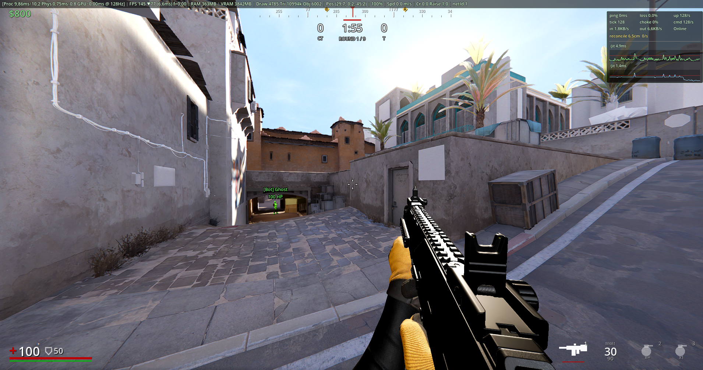

<h1>
  
  &nbsp;VANTIX
</h1>

> Tactical multiplayer shooter built with Godot 4.6 and C#. UNDER HEAVY DEVELOPMENT

[]()
[](https://godotengine.org/)
[](https://dotnet.microsoft.com/)
[](https://discord.gg/Fhzrjk8yJb)

<p align="center">
  <video src="https://github.com/justin-bobr/eta-multiplayer/raw/master/Screenshots/trailer.mp4" controls muted width="98%"></video>
</p>

<p align="center">
  
  
</p>

5v5 round-based shooter — and a framework for AAA-grade techniques (server-authoritative netcode, lag compensation, sub-tick input, voxel smoke). Core systems are working: networking, weapons, movement, smoke. More content coming.

**Goal:** build an open-source shooter that showcases what AAA-grade techniques look like in practice — and that's actually fun to play. 😉

**Code is open source; assets are not — and are no longer bundled in this repo.** See [Assets & Access](#assets--access) and [LICENSE.md](LICENSE.md).

**📖 API docs:** [Docs/README.md](https://github.com/justin-bobr/vantix/blob/main/Docs/README.md)

---

## Requirements

- Godot 4.6 with .NET support
- .NET 8 SDK
- Windows (D3D12)

## Tech Stack

| | |
|---|---|
| Engine | Godot 4.6 (Forward+, D3D12) |
| Language | C# / .NET 8 |
| Physics | Jolt @ 128 Hz |
| Networking | LiteNetLib 2.1.4 (UDP) |
| Formatter | CSharpier 0.30 |

---

## Features

### Networking & Anti-Cheat
- **Server authority** — server decides what actually happens (prevents cheating).
- **Client prediction** — your PC shows movement instantly, server verifies after.
- **Lag compensation** — server rewinds physics to match your input timing.
- **Tick-based input** — every keypress is timestamped at 128 Hz for fairness.
- **Fog of war** — enemies behind walls are culled before sending packets to you.
- **Reconnect grace** — leave and rejoin without losing your character state.
- **Kernel Based AC** — Will be released later and is not a part of this repo (only for core devs accessable with nda closure).

### Movement
- **Walk / Sprint / Crouch** — different speeds, different sounds.
- **Jump tech** — coyote frames, jump buffering, crouch-jump bonus.
- **Wall tech** — wall jump and wall cling for advanced mobility.
- **Slide** — crouch while sprinting to boost forward and slide.
- **Stamina** — sprint drains stamina, regenerates when resting. Hold breath with Q.
- **Auto-mantle** — climb up to 1.75m ledges automatically.

### Combat
- **Hitscan weapons** — instant hit, no bullet travel time.
- **Per-limb damage** — head, chest, waist, legs, feet each have different values.
- **Armor system** — soaks 50% of body damage, headshots ignore armor.
- **Health regen** — slowly heal over time after not taking damage.
- **Spread & recoil** — deterministic per-weapon firing pattern, same on all clients.
- **Wall penetration** — some walls block shots; some let bullets through.
- **ADS (Aim Down Sights)** — zoomed precision mode with weapon-specific bonuses.

### Weapons
- Each weapon is a `.tscn` + C# script with 40+ stats (fire rate, recoil, bloom, kick).
- **Layered audio** — different sounds for near/medium/far distance.
- **Shell ejection** — realistic casings from a pool.
- **Muzzle flash** — visual feedback on each shot.

### Grenades & Smoke
- **Smoke voxel system** — 0.6m voxels, wind + buoyancy, blocks vision and bullets.
- **Deterministic trajectory** — you and teammates see the same grenade path.
- **Shot disturbance** — bullets clear a path through smoke.

### Operator Abilities (planned)
Each match, players pick one ability from a pool (no duplicates per team):
- Sprint Surge (+25% speed), Recon Wire (tripwire), Pulse Scan (radar), Stim Patch (heal), Spotter Drone, Ammo Cache, Sound Decoy, Heartbeat Sensor, Brace (reduce damage), Steady Aim (0 spread), Long Breath (double hold).

### Graphics & HUD
- **Post-process FX** — motion blur, film grain, chromatic aberration, sharpening, vignette.
- **Anti-aliasing** — FXAA, SMAA, or TAA.
- **Shadow quality** — Low (1024) / Medium (2048) / High (4096).
- **Atmospherics** — volumetric fog, cloud shadows, god rays, dust.
- **HUD** — compass, vitals (HP/armor/stamina), money, scoreboard, killfeed, dynamic crosshair.

### Audio
- **Per-material footsteps** — 33 different surfaces with unique sounds.
- **Occlusion** — walls muffle distant audio.
- **Environment reverb** — outdoor / indoor / tunnel reverb types.
- **Weapon audio** — Body, Mechanics, Tail, and Distant variants based on distance.

### Bot AI
- **Waypoint patrol** — bots wander between map points.
- **Reactive avoidance** — raycast obstacles to stay out of walls.
- **Combat AI** — aim assist, reaction time scaling with difficulty (0-3).
- **Drop-in replacement** — a real player can join a bot's slot at any time.

### Developer Tools
- **In-game console** (F10 or `^`) — run commands, tune ConVars at runtime.
- **~175 ConVars** — ~80 server-side, ~95 client-side, per-weapon overrides.
- **Debug visuals** — `sv_debug_hitboxes`, `sv_debug_capsule`, `sv_debug_aimray`.
- **NetGraph** — ping, packet loss, pps, tick, choke, reconciliation drift.
- **Performance overlay** — CPU/GPU ms, FPS rolling min, memory / VRAM / draw calls.

---

## Project Layout

```
codebase/
  net/                Networking, prediction, packets
  fx/                 Graphics effects
  hud/                UI (health, compass, radar)
  settings/           Settings menu
  authority/          Player logic (local, server, bot)
weapons/              Weapon definitions
maps/                 Game maps
character/            Player models and animations
```

---

## Getting Started

### Clone & Build

```bash
git clone <repo-url> vantix
cd vantix
dotnet tool restore
```

Open in Godot, then hit **Build** (hammer icon).

### Run the Game

```bash
godot                                      # Main menu
godot -- --server                          # Local server
godot -- --server --bots 5                 # Server + 5 AI bots
godot -- --connect 127.0.0.1:27015         # Auto-connect to server
```

### Common Flags

| Flag | What it does |
|---|---|
| `--server` | Start a dedicated server |
| `--listen` | Start server + local player |
| `--connect HOST:PORT` | Join a server |
| `--bots N` | Add N AI bots |
| `--port N` | Change port (default: 27015) |

### Controls

| Action | Key |
|---|---|
| Move | `WASD` |
| Sprint / Toggle sprint | `Shift` / `X` |
| Jump / Crouch | `Space` / `Ctrl` |
| Shoot / Aim | `LMB` / `RMB` |
| Reload / Inspect | `R` / `F` |
| Hold breath | `Q` |
| Swap weapon | `1` / `2` |
| Scoreboard | `Tab` |
| Menu | `Esc` |
| Console | `F10` |

---

## Code Style

**CSharpier-enforced.** VSCode is configured to auto-format on save.

```bash
dotnet csharpier codebase           # Auto-format all code
dotnet csharpier --check codebase   # Check without changing (for CI)
```

**Commenting:** Every method must have an English `/// <summary>` XML doc above it. No inline `//` comments inside method bodies — put everything in the XML doc.

## Contributing

**For code contributions:**
1. Fork the repo → create a feature branch → open a PR against `main`.
2. Run `dotnet csharpier --check codebase` and make sure it passes (no formatting issues).
3. For large features, open an issue first to discuss the approach.

**For assets (models, textures, audio, etc.):**
- Assets need explicit licensing to be included.
- See [LICENSE.md](LICENSE.md) for details.

If you find your work included without credit, open an issue.

---

## Work in Progress

Systems currently being built or stabilised:

- **FPS animations** — partly ready.
- **TPS animations** — not ready yet (needs retarget).
- **Fog of war** — functional but has open issues; needs further investigation.
- **Game logic** — round-based match flow (in progress).

---

## Roadmap

- Buy menu & economy system
- Operator abilities (11 total)
- More weapons (AR, AWP, pistols)
- Flash and HE grenades
- Linux & macOS support
- Match replay system
- Creator workshop (skins, maps, 100% revenue to creator)

---

## Credits

- **Godot Engine** — Juan Linietsky, Ariel Manzur & contributors
- **Jolt Physics** — Jorrit Rouwé
- **LiteNetLib** — Ruslan Pyrch (RevenantX)
- **Programming** — Stefan Kalysta
- **Character model** — SelfTarget (Ukraine) — commercial use permitted (only for this game / demo).
- **Animations** — Stefan Kalysta (Germany) — **not** licensed for commercial use.
- **Map assets (de_dust2)** — ExtraVFX (Kazakhstan), via [Counter-Strike 2 Maps Pack (CGTrader)](https://www.cgtrader.com/3d-models/exterior/other/counter-strike-2-maps-pack) — for testing and learning only.
- **Training map** — Dekogon Studios LLC — commercial license, licensed for this game only.
- **FX** — Stefan Kalysta.
- **Audio** — Audio Planet — licensed for this game / demo only (license granted).

## License

**No commercial intent** — this is a non-commercial, open-source project and it stays that way. The code remains open source; asset licenses are respected as listed above.

Full terms are in [LICENSE.md](LICENSE.md). In short:

- **Code** — Apache License 2.0 (`.cs`, shaders, scene-wiring scripts, config, build files).
- **Assets** — **All Rights Reserved.** Meshes, rigs, animations, maps, textures, audio, FX, fonts, UI and branding are **not** covered by the code license.
  - Map models are from CGTrader and are for **testing/learning purposes only**.
  - Original game content (CS2) is Valve's intellectual property — used only as a case study. It's a test map for this game until our own first map is finished.

If in doubt whether a file is "code" or "asset", treat it as an asset and ask the original rights holder first.

---

## Notes

**Code commenting**: Fully handled by Claude Code due to time constraints. The code logic itself is hand-written and not AI-trained.

**Everything else is human-made**: Textures, models and animations — as well as all scenes, nodes and the overall setup — are created by hand, not AI-generated.

**Formerly "ETA"**: The project was renamed to **VANTIX**. The old name collides with the Basque organisation *ETA*, which caused problems — especially in Spain — alongside search confusion and branding/legal risk, so we rebranded.

---

## Assets & Access

The game assets — meshes, rigs, animations, maps, textures, audio and FX — are **no longer included in this repository.** The code is open source and builds on its own, but the art content has been removed from the project tree and is only available **after approval.**

> **Note:** Asset access is granted **only for contribution requests** — i.e. people actively contributing to the project. It is not a general download for playing or reusing the content.

**How to get access:**

1. Join the [Discord](https://discord.gg/Fhzrjk8yJb) and complete onboarding.
2. Sign the asset agreement — confirming that the assets will **not** be redistributed (now or in the future) and that access is granted **solely** for use within this project.
3. Request full access via **DM** — a request form has been prepared for this.

**Why:** We are currently building our own custom map together with several artists whose work may be **used within this project only, but not publicly redistributed.** Removing the assets from the repository lets us honor and respect that agreement.
